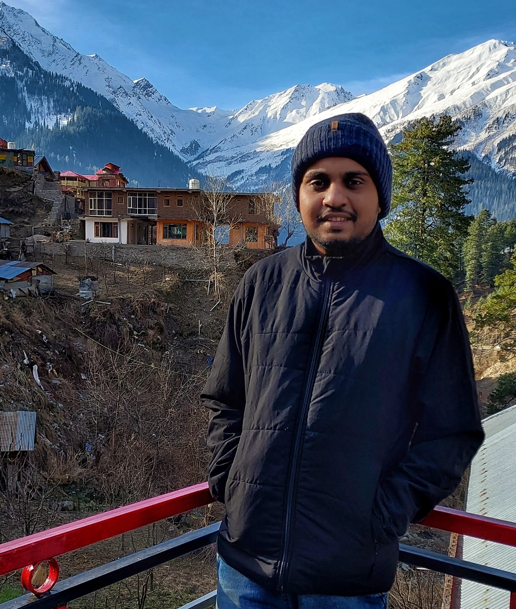
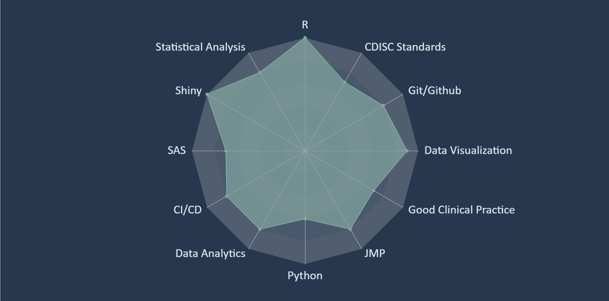

```{css, echo=FALSE}
[data-id="skills"] {
    line-height: 1.25;
}

[data-id="disclaimer"] {
    right: -2rem;
    color: #ccc;
    word-wrap: break-word !important;
    width: 220px !important;
}

.aside {
    width: 13rem;
    padding: 0.2in 0.2in;
    font-size: 0.7rem;
    float: right;
    position: absolute;
    right: -50px;
    color: aliceblue;
}

.aside .level2 {
    margin-top: 0.28in;
}

.aside a {
   color: aliceblue;
}

.aside h2 {
    font-weight: 600;
    font-size: 0.9rem;
    color: aliceblue;
    text-transform: capitalize;
}

.pagedjs_page {
    --sidebar-background-width: 200px !important;
    --sidebar-background-color: darkslategray !important;

[data-id="main"] {
    width: 6in;
    padding: 0 0.15in 0 0.1in;
    font-size: 0.6rem;
    float: left;
}

.aside img {
    max-width: 100%;
    width: 180px !important;
    border-radius: 85px !important;
}

#skills-overview > p > img {
    max-width: 80%;
    position: relative;
    right: -66px;
    border: 1px solid #ccc;
}

#disclaimer > p > a {
   color: #84A7A1;
}
```

# Aside

{width="80%"}

## Contact {#contact}

-   <i class="fa fa-google"></i> [sukalposaha\@gmail.com](mailto:sukalposaha@gmail.com){.email}
-   <i class="fa fa-linkedin"></i> [sukalpo-saha-186329b1](https://www.linkedin.com/in/sukalpo-saha-186329b1/)
-   <i class="fa fa-github"></i> [ahasoplakus](https://github.com/ahasoplakus/)
-   <i class="fa fa-twitter"></i> [\@saha_sukalpo](https://x.com/saha_sukalpo/)
-   <i class="fa fa-phone"></i> +91 7738013890

## Programming Languages {#skills}

-   R
-   Shiny
-   SAS
-   JMP
-   Python

## Domain Knowledge {#skills}

-   Statistical Analysis
-   Data Analytics
-   CDISC Standards
-   Good Clinical Practice
-   Tables and Figures

## Languages {#skills}

-   English
-   Bengali
-   Hindi

Main
================================================================================

Sukalpo Saha {#title}
--------------------------------------------------------------------------------

### R and Shiny Developer with 6.5+ years of experience in the Pharmaceutical Industry

Developing production ready R packages and Shiny applications which enable creation of company standard ADaM data sets, TLFs, and 
interactive exploration of statistical analysis results, to support medical writing and/or publishing of the clinical study reports, planned analysis, and any other ad hoc result.

Passionate about innovating, modernizing statistical programming and reporting using open-source tools and technologies (R/Python); building web applications with cutting edge UI/UX and data visualizations.

Experience {data-icon="suitcase"}
--------------------------------------------------------------------------------

### {width="15%"}

<b>Principal Statistical Data Scientist</b>

Mumbai, IN

Present-2023

::: concise
-   Maintaining the [admiralvaccine](https://pharmaverse.github.io/admiralvaccine/) R package (Vaccine extension of <b>admiral</b>) within the [pharmaverse](https://github.com/pharmaverse) group of packages.
-   Co-developer of the [admiralpeds](https://pharmaverse.github.io/admiralpeds/) R package (<b>admiral</b> package extension for pediatric trials).
-   Contributing in development of the R package(s) to create Pfizer Specific ADaM data sets and TLFs.
-   Contributed in developing the R Shiny Web application [cvars](https://github.com/phuse-org/aesummaries) wrapped as an R package to generate interactive forest and volcano plots for for adverse event and FDA Medical Queries (FMQs) analysis outputs for inclusion in submissions to the FDA.
-   Create/maintain customized CI/CD pipelines for R packages using Github Actions.
-   Training/mentoring associate/junior programmers and data scientists in developing R packages and Shiny applications.
:::

### {width="11.5%"}

<b>Senior Programmer (R & Shiny)</b>

Bangalore, IN

2022 - 2021

::: concise
-   Work with clinical programmers/statistical analysts and other internal customers to understand business requirements and industry regulations.
-   Design, create, maintain, and develop standard tools and applications for internal customers.
-   Provide scalable, secure, and modern UI/UX when required.
-   Provide high quality and efficient code, perform code review, writing unit tests, end-to-end tests, and sharing of best practices.
-   Hands-on with clinical trial data to create appropriate and high-quality tools.
-   Deliver documentation and training material for standard tools and applications.
:::

### {width="20%"}

<b>Business Process Lead (Team Lead)</b>

Mumbai, IN

2021 - 2017

::: concise
-   Team lead for the Centralized Statistical Monitoring and Quality Tolerance Limit (QTL) team consisting a group 10-12 Statisticians/Statistical Programmers.
-   Co-developer of the in-house R package used in QTL Analysis (based on <b>Bayesian Hierarchical Model</b>) for Key Risk Indicators i.e. Adverse Events, Serious Adverse Events, Ongoing, Baseline Protocol Deviations and also Study specific parameters.
-   Developed a Shiny application to trigger the QTL Reports quarterly for each study.
-   Helped study teams set up and implement QTLs in their respective studies, and take actions in case of a breach.
-   Created a Shiny application to monitor the impact of Covid-19 on Clinical data quality based on Adverse Events, Protocol Deviations, Missing Visits etc
:::

Education {data-icon=graduation-cap data-concise=true}
--------------------------------------------------------------------------------

### {width=30px style="display: inline-block;; margin:0 auto"} University of Hyderabad

M.Sc in Statistics

Hyderabad, IN

2017

Specialization: Biostatistics, Operations Research

Class: First

### {width=30px style="display: inline-block;; margin:0 auto"} University of Calcutta

B.Sc in Statistics

Kolkata, IN

2015

Major: Statistics <br> Minors: Economics, Mathematics </br>

Class: First


## Skills Overview {data-icon="laptop"}

{width="100%"}

Publications/Presentations {data-icon=file}
--------------------------------------------------------------------------------

### Clinical Visual Analytics for Review and Submission

[Presentation](https://phuse.s3.eu-central-1.amazonaws.com/Archive/2023/SDE/APAC/Chennai/PRE_Chennai02.pdf) for PHUSE SDE India

Chennai, IN

2023

### Utilizing a Bayesian Hierarchical Model to Design Quality Into a Clinical Trial

[Poster](https://www.diaglobal.org/en/flagship/dia-2020/program/about-our-offerings/posters/Poster-Presentations/Poster-Presentations-Details?ParentProductID=8258687&ProductID=8793367&AbstractID=90694) for DIA Global Annual Meeting

Virtual

2020

Disclaimer {#disclaimer}
--------------------------------------------------------------------------------

Built with [**pagedown**](https://github.com/rstudio/pagedown)<br>Last updated on `r Sys.Date()`
